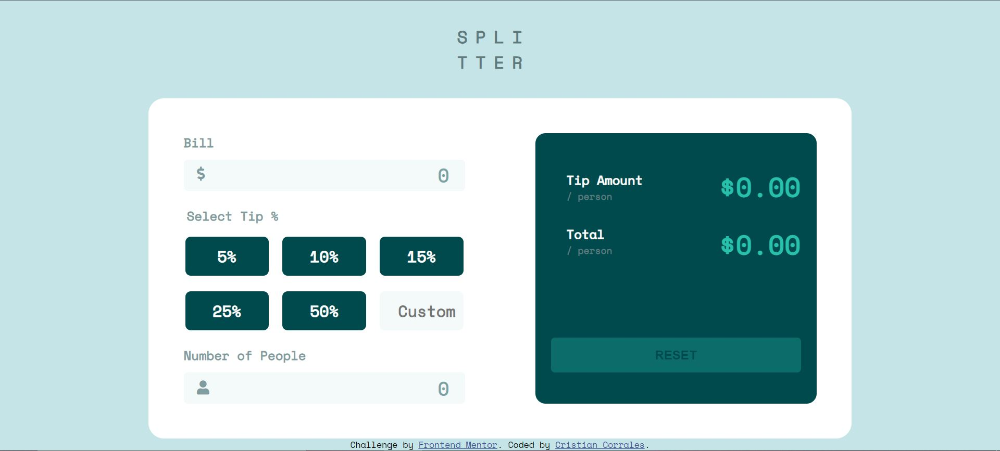

# Frontend Mentor - Tip calculator app solution

This is a solution to the [Tip calculator app challenge on Frontend Mentor](https://www.frontendmentor.io/challenges/tip-calculator-app-ugJNGbJUX). Frontend Mentor challenges help you improve your coding skills by building realistic projects.

## Table of contents

- [Overview](#overview)
  - [The challenge](#the-challenge)
  - [Screenshot](#screenshot)
  - [Links](#links)
- [My process](#my-process)
  - [Built with](#built-with)
  - [What I learned](#what-i-learned)
  - [Continued development](#continued-development)
- [Author](#author)

## Overview

### The challenge

Users should be able to:

- View the optimal layout for the app depending on their device's screen size
- See hover states for all interactive elements on the page
- Calculate the correct tip and total cost of the bill per person

### Screenshot



### Links

- Solution URL: [Solution Page](https://www.frontendmentor.io/solutions/tip-calculator-solution-VNDjlJwai)
- Live Site URL: [Live Site](https://crisdevs.github.io/tip-calculator-app-main/)

### Built with

- HTML
- CSS
- Flexbox
- Javascript
- DOM Manipulation

### What I learned

This was a tough project for me at this time but happy to say I finally got it working. I learned how to create a project from scratch without any tutorial guiding me. It was definitely a scarier process but one where I am glad I was able to overcome. 
#### Javascript
While doing this project I also came across a couple of articles on why global variables are bad practices which in short is because you can accidentally change the value of a variable that you were not trying to change in the first place and break a part of your code. So to combat this I wrapped my Javascript in an IIFE in where I learned that an IIFE (Immediately Invoked Function Expression) is a function that is called as soon as you define it. Now that my code is in the IIFE, the variables and functions in the IIFE can't be accessed outside the IIFE. 

Here you can find the documentation for IIFE: https://developer.mozilla.org/en-US/docs/Glossary/IIFE

Some code that I thought was pretty cool in my Javascript file was this
```js
//Event listener to prevent invalid input from being typed.
    numInputs[i].addEventListener("keydown", (e) => {
      if (e.target.name === "num-people") {
        if (e.key === "-" || e.key === "e" || e.key === ".") {
          e.preventDefault();
        }
      } else {
        if (e.key === "-" || e.key === "e") {
          e.preventDefault();
        }
      }
    });
```
I should say that this is inside of a for loop and numInputs holds a collection of number inputs. But this Javascript code adds an event listener for the "keydown" event. When that "keydown" event happens, it will check which input the event is happening on. Depending on the input it will restrict the user input with certain characters such as "-", "e", ".". The reason for this is I chose to use a number input for my HTML inputs to make the error checks simpler. Number inputs allow for numbers and the following characters "-", "e", ".".
```html
 <input
            type="number"
            name="bill"
            id="bill-input"
            class="text-input text-input-grey number-input"
            value="0"
          />
```

#### CSS
Before this project, I haven't written CSS in a couple of months. This was a nice refresher and I learned this really cool trick with the radio buttons and the label associated.
```css
fieldset input[type="radio"]:checked + label, fieldset input[type="radio"]:hover + label {
  color: hsl(183, 100%, 15%);
  background-color: hsl(172, 67%, 45%);
  border-color: hsl(172, 67%, 45%);
}
```
What this snippet of CSS is doing is selecting the radio buttons that are checked or that are being hovered and changing the style of the label that is right after the radio button in the HTML.

### Continued development

For my next project, I would love to focus on strengthening my Javascript OOP concepts. At some point, I would also like to learn about API and asynchronous Javascript. I also feel like my HTML is not very good in this project so I would like to strengthen that skill in future projects.

## Author

- Frontend Mentor - [@crisdevs]([https://www.frontendmentor.io/profile/yourusername](https://www.frontendmentor.io/profile/crisdevs)https://www.frontendmentor.io/profile/crisdevs)
